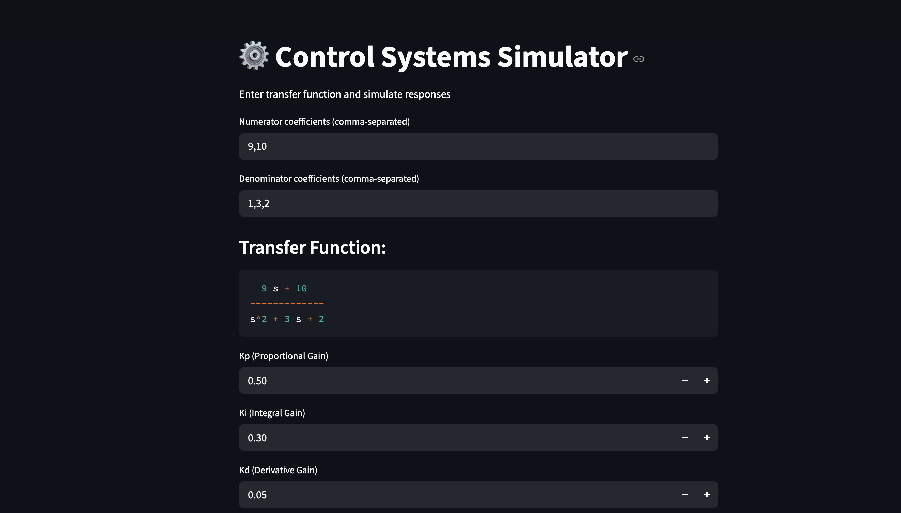
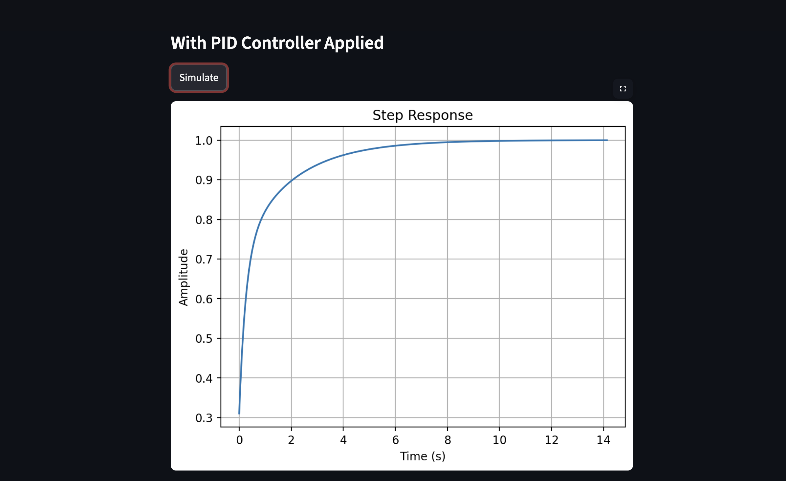
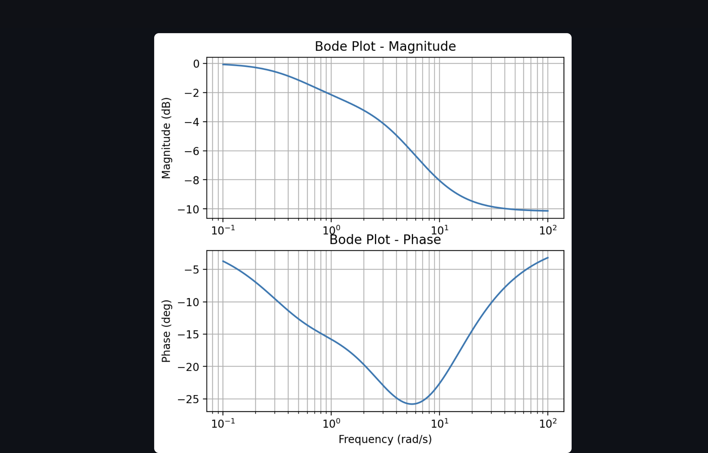
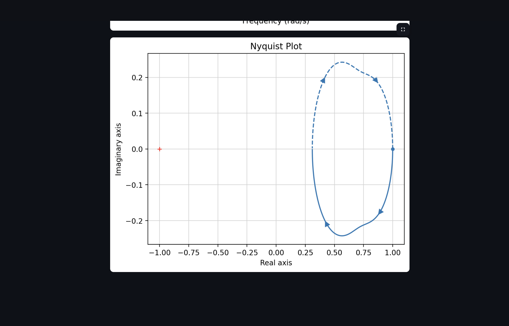

# ⚙️ Control Systems Simulator  

An interactive web-based simulator for **control systems** that allows you to:  
- Define custom transfer functions.  
- Apply **PID control (Kp, Ki, Kd)**.  
- Visualize responses: **Step Response**, **Bode Plot**, and **Nyquist Plot**.  

Built with **Python**, **Streamlit**, **Matplotlib**, and **Control Systems Library**.  

---

## 🚀 Features  

- 🎛️ Input **numerator & denominator coefficients** to define your transfer function.  
- 🔧 Adjust **PID parameters (Kp, Ki, Kd)** interactively.  
- 📈 Generate and analyze:  
  - Step Response  
  - Bode Plot (Magnitude & Phase)  
  - Nyquist Plot  
- 🖥️ Clean, interactive UI powered by **Streamlit**.  

---

## 📸 Screenshots  

### Input Transfer Function & PID Parameters  
  

### Step Response  
  

### Bode Plot  
  

### Nyquist Plot  
  

---

## 🛠️ Installation  

Clone this repository:  

```bash
git clone https://github.com/your-username/control-systems-simulator.git
cd control-systems-simulator
```

---

## ▶️ Usage  

Run the Streamlit app:  

```bash
streamlit run app.py
```

Then open [http://localhost:8501](http://localhost:8501) in your browser.  

---

## 📦 Dependencies  

- [streamlit](https://streamlit.io/)  
- [matplotlib](https://matplotlib.org/)  
- [numpy](https://numpy.org/)  
- [scipy](https://scipy.org/)  
- [python-control](https://python-control.readthedocs.io/)  

Install them manually if needed:  

```bash
pip install streamlit matplotlib numpy scipy control
```

---

## 📚 Example  

Example transfer function:  

- Numerator: `9, 10`  
- Denominator: `1, 3, 2`  

Resulting transfer function:  

\[
\frac{9s + 10}{s^2 + 3s + 2}
\]  

With PID parameters:  
- Kp = 0.5  
- Ki = 0.3  
- Kd = 0.05  

You’ll see the plots similar to the screenshots above.  

---

## 🤝 Contributing  

1. Fork the repo 🍴  
2. Create your feature branch (`git checkout -b feature/my-feature`)  
3. Commit changes (`git commit -m 'Add my feature'`)  
4. Push to branch (`git push origin feature/my-feature`)  
5. Open a Pull Request 🚀  

---

## 📜 License  

This project is licensed under the **MIT License** – feel free to use, modify, and distribute.  
